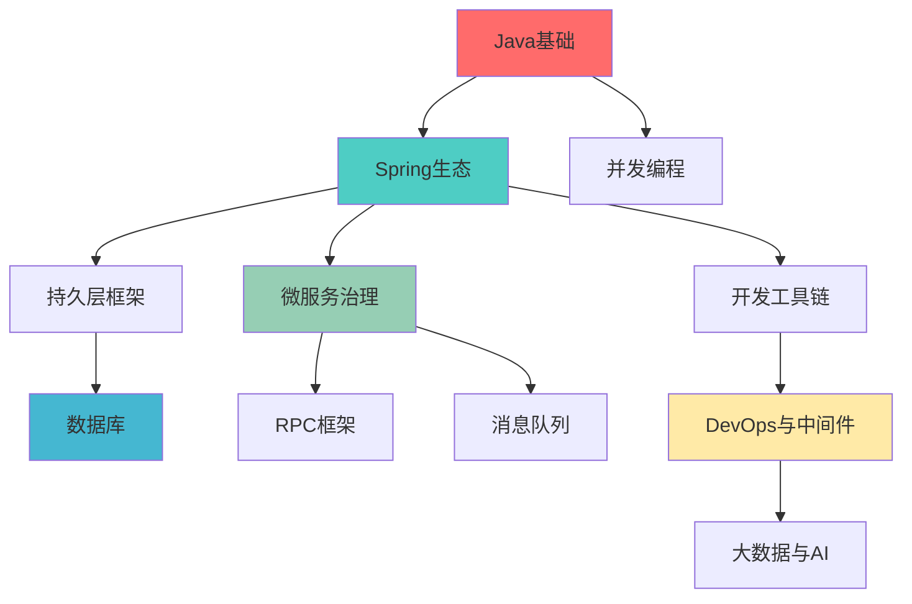

# Java后端技术栈学习路线图

> @author erik.zhou

## 📋 目录
- [学习路径总览](#学习路径总览)
- [各阶段详细规划](#各阶段详细规划)
- [学习时间估算](#学习时间估算)
- [学习方法建议](#学习方法建议)

## 🗺️ 学习路径总览

## 📚 各阶段详细规划

### 阶段一：Java基础 (1-2个月)

**学习目标**：掌握Java语言核心特性和JVM底层原理

#### 必学内容
1. **Java基础** (20-30小时)
   - 基础语法、面向对象
   - 集合框架、IO流
   - 异常处理、泛型
   - 反射、注解
   - JDK 8+ 新特性（Lambda、Stream、Optional）

2. **JVM** (30-40小时)
   - 内存模型（堆、栈、方法区）
   - 垃圾回收机制（GC算法、收集器）
   - 类加载机制
   - 性能调优（JVM参数、工具使用）

3. **并发编程** (25-35小时)
   - 线程基础、线程池
   - synchronized、volatile
   - Lock、AQS
   - 并发容器、原子类
   - JUC工具类

4. **设计模式** (15-25小时)
   - 创建型模式（单例、工厂、建造者）
   - 结构型模式（代理、装饰器、适配器）
   - 行为型模式（观察者、策略、模板方法）

**学习检查清单**
- [ ] 能够独立编写多线程程序
- [ ] 理解JVM内存模型和GC原理
- [ ] 掌握常用设计模式的应用场景
- [ ] 能够进行基础的JVM调优

---

### 阶段二：Spring生态 (2-3个月)

**学习目标**：掌握Spring全家桶，能够开发企业级应用

#### 必学内容
1. **Spring Framework** (25-35小时)
   - IoC容器、依赖注入
   - AOP面向切面编程
   - 事务管理
   - Bean生命周期

2. **Spring Boot** (30-40小时) 🔥
   - 自动配置原理
   - Starter机制
   - 配置管理（application.yml）
   - Actuator监控
   - 条件注解

3. **Spring MVC** (20-30小时)
   - 请求处理流程
   - 参数绑定、数据校验
   - 拦截器、过滤器
   - 异常处理
   - RESTful API设计

4. **MyBatis/MyBatis-Plus** (20-30小时)
   - 映射器配置
   - 动态SQL
   - 一级/二级缓存
   - MyBatis-Plus增强功能

**学习检查清单**
- [ ] 能够搭建Spring Boot项目
- [ ] 理解Spring IoC和AOP原理
- [ ] 能够开发RESTful API
- [ ] 掌握MyBatis的使用和优化

---

### 阶段三：数据库 (1-2个月)

**学习目标**：掌握关系型和NoSQL数据库的使用和优化

#### 必学内容
1. **MySQL** (40-50小时) 🔥
   - SQL基础（增删改查、连接查询）
   - 索引原理和优化
   - 事务和锁机制
   - 慢查询优化
   - 主从复制、分库分表

2. **Redis** (30-40小时) 🔥
   - 5种数据类型及应用场景
   - 持久化机制（RDB、AOF）
   - 缓存策略（穿透、击穿、雪崩）
   - 分布式锁
   - 集群模式

3. **MongoDB** (15-25小时)
   - 文档模型
   - CRUD操作
   - 聚合管道
   - 索引优化

4. **Elasticsearch** (25-35小时)
   - 倒排索引原理
   - 查询DSL
   - 聚合分析
   - 集群架构

**学习检查清单**
- [ ] 能够设计合理的数据库表结构
- [ ] 掌握MySQL索引优化技巧
- [ ] 能够使用Redis解决实际问题
- [ ] 理解ES的搜索原理

---

### 阶段四：微服务 (2-3个月)

**学习目标**：掌握微服务架构和分布式系统开发

#### 必学内容
1. **Spring Cloud** (35-45小时)
   - 服务注册与发现（Eureka/Nacos）
   - 配置中心（Config/Nacos）
   - 服务网关（Gateway）
   - 负载均衡（Ribbon/LoadBalancer）
   - 服务调用（Feign）

2. **Nacos** (15-25小时)
   - 服务注册与发现
   - 配置管理
   - 集群部署

3. **Sentinel** (15-25小时)
   - 流量控制
   - 熔断降级
   - 热点参数限流

4. **Seata** (20-30小时)
   - 分布式事务原理
   - AT模式、TCC模式
   - Saga模式

5. **Dubbo** (20-30小时)
   - RPC原理
   - 服务暴露与引用
   - 负载均衡策略
   - 容错机制

**学习检查清单**
- [ ] 能够搭建微服务架构
- [ ] 理解服务注册发现原理
- [ ] 掌握分布式事务解决方案
- [ ] 能够进行服务治理和监控

---

### 阶段五：中间件 (1-2个月)

**学习目标**：掌握常用中间件的使用和原理

#### 必学内容
1. **消息队列** (30-40小时)
   - RabbitMQ（交换机、队列、消息确认）
   - Kafka（生产者、消费者、分区、副本）
   - RocketMQ（事务消息、延迟消息）

2. **Docker/Kubernetes** (35-45小时)
   - Docker镜像、容器
   - Dockerfile编写
   - K8s核心概念（Pod、Service、Deployment）
   - K8s部署和管理

3. **Netty** (20-30小时)
   - NIO原理
   - Channel、Pipeline
   - 编解码器
   - 实战案例

**学习检查清单**
- [ ] 能够选择合适的消息队列
- [ ] 掌握Docker容器化部署
- [ ] 理解K8s的核心概念
- [ ] 能够使用Netty开发网络应用

---

### 阶段六：监控与运维 (1个月)

**学习目标**：掌握系统监控和日志分析

#### 必学内容
1. **ELK** (20-30小时)
   - Elasticsearch存储
   - Logstash日志收集
   - Kibana可视化

2. **SkyWalking** (15-25小时)
   - 链路追踪
   - 性能分析
   - 告警配置

3. **Prometheus+Grafana** (15-25小时)
   - 指标采集
   - PromQL查询
   - 仪表盘配置

**学习检查清单**
- [ ] 能够搭建日志收集系统
- [ ] 掌握链路追踪的使用
- [ ] 能够配置监控告警

---

### 阶段七：进阶 (持续学习)

**学习目标**：拓展技术视野，了解前沿技术

#### 选学内容
1. **大数据** (根据需求选择)
   - Hadoop生态
   - Spark计算框架
   - Flink流处理

2. **Spring AI** (新兴技术)
   - AI集成
   - 向量数据库
   - RAG应用

**学习检查清单**
- [ ] 了解大数据技术栈
- [ ] 掌握AI集成方案

---

## ⏱️ 学习时间估算

| 阶段 | 预计时长 | 累计时长 |
|------|---------|---------|
| 阶段一：Java基础 | 1-2个月 | 1-2个月 |
| 阶段二：Spring生态 | 2-3个月 | 3-5个月 |
| 阶段三：数据库 | 1-2个月 | 4-7个月 |
| 阶段四：微服务 | 2-3个月 | 6-10个月 |
| 阶段五：中间件 | 1-2个月 | 7-12个月 |
| 阶段六：监控与运维 | 1个月 | 8-13个月 |
| 阶段七：进阶 | 持续学习 | - |

**说明**：
- 以上时间基于每天学习2-3小时估算
- 实际时间因个人基础和学习效率而异
- 建议边学边做项目，加深理解

---

## 💡 学习方法建议

### 1. 理论+实践结合
- 每学完一个知识点，立即动手实践
- 通过编写Demo加深理解
- 参与开源项目或实战项目

### 2. 构建知识体系
- 使用思维导图整理知识点
- 建立技术之间的关联
- 定期回顾和总结

### 3. 深入源码学习
- 阅读Spring、MyBatis等框架源码
- 理解设计思想和实现原理
- 学习优秀的代码风格

### 4. 关注技术动态
- 关注官方文档更新
- 阅读技术博客和论文
- 参加技术社区和会议

### 5. 刻意练习
- 针对薄弱环节重点突破
- 多做算法题和系统设计题
- 准备技术面试

---

## 🎯 学习里程碑

### 初级阶段（0-3个月）
- ✅ 掌握Java基础和Spring Boot
- ✅ 能够开发简单的CRUD应用
- ✅ 理解基本的数据库操作

### 中级阶段（3-8个月）
- ✅ 掌握微服务架构
- ✅ 能够使用Redis、消息队列
- ✅ 理解分布式系统原理

### 高级阶段（8-12个月）
- ✅ 掌握系统设计和架构能力
- ✅ 能够进行性能优化和故障排查
- ✅ 具备技术选型和方案设计能力

### 专家阶段（12个月+）
- ✅ 深入理解底层原理
- ✅ 能够解决复杂的技术问题
- ✅ 具备技术领导力

---

## 📖 推荐学习资源

### 书籍
- 《Java核心技术》
- 《深入理解Java虚拟机》
- 《Spring实战》
- 《高性能MySQL》
- 《Redis设计与实现》

### 在线资源
- 官方文档（优先）
- GitHub开源项目
- 技术博客和公众号
- 在线课程平台

### 实战项目
- 电商系统
- 社交平台
- 内容管理系统
- 分布式任务调度系统

---

**记住：学习是一个持续的过程，保持好奇心和学习热情！** 🚀
