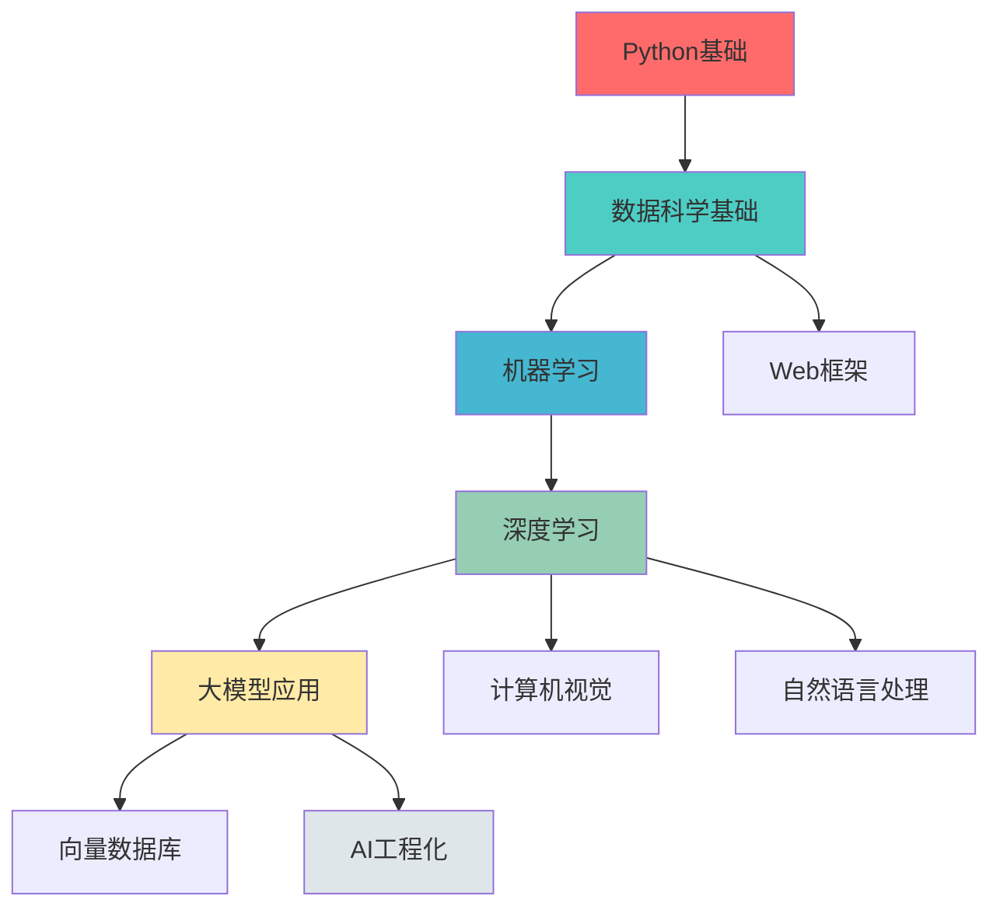

# Python-AI技术栈学习路线图

> @author erik.zhou

## 📋 目录
- [学习路径总览](#学习路径总览)
- [各阶段详细规划](#各阶段详细规划)
- [学习时间估算](#学习时间估算)
- [学习方法建议](#学习方法建议)

## 🗺️ 学习路径总览

## 📚 各阶段详细规划

### 阶段一：Python基础 (1-2个月)

**学习目标**：掌握Python语言核心特性和编程思想

#### 必学内容
1. **Python基础** (25-35小时)
   - 基础语法、数据类型
   - 控制流、函数
   - 面向对象编程
   - 模块和包
   - 文件操作、异常处理

2. **Python进阶** (20-30小时)
   - 装饰器、生成器
   - 上下文管理器
   - 迭代器和可迭代对象
   - 元类和反射
   - 函数式编程

3. **异步编程** (15-25小时)
   - asyncio基础
   - async/await语法
   - 协程和任务
   - 异步IO操作

**学习检查清单**
- [ ] 能够独立编写Python程序
- [ ] 理解面向对象编程思想
- [ ] 掌握常用标准库的使用
- [ ] 能够使用异步编程处理并发

---

### 阶段二：数据科学基础 (2-3个月)

**学习目标**：掌握数据处理和分析的核心工具

#### 必学内容
1. **NumPy** (20-30小时) 🔥
   - 数组创建和操作
   - 数组运算和广播
   - 索引和切片
   - 线性代数运算

2. **Pandas** (30-40小时) 🔥
   - DataFrame和Series
   - 数据读取和写入
   - 数据清洗和转换
   - 分组聚合和透视表

3. **Matplotlib/Seaborn** (20-30小时)
   - 基础绘图
   - 图表类型（折线图、柱状图、散点图）
   - 图表美化
   - 统计可视化

4. **数据预处理** (15-25小时)
   - 缺失值处理
   - 异常值检测
   - 数据标准化和归一化
   - 特征编码

**学习检查清单**
- [ ] 能够使用NumPy进行数值计算
- [ ] 掌握Pandas的数据处理技巧
- [ ] 能够创建各种数据可视化图表
- [ ] 理解数据预处理的重要性

---

### 阶段三：机器学习 (2-3个月)

**学习目标**：掌握机器学习算法和应用

#### 必学内容
1. **Scikit-learn** (30-40小时) 🔥
   - 监督学习（分类、回归）
   - 无监督学习（聚类、降维）
   - 模型评估和选择
   - 管道和网格搜索

2. **机器学习算法** (35-45小时)
   - 线性回归、逻辑回归
   - 决策树、随机森林
   - SVM、KNN
   - 朴素贝叶斯
   - 集成学习

3. **特征工程** (20-30小时)
   - 特征选择
   - 特征提取
   - 特征构造
   - 降维技术（PCA、t-SNE）

4. **模型评估与调优** (15-25小时)
   - 交叉验证
   - 评估指标
   - 超参数调优
   - 模型融合

**学习检查清单**
- [ ] 理解常见机器学习算法原理
- [ ] 能够使用Scikit-learn构建模型
- [ ] 掌握特征工程技巧
- [ ] 能够评估和优化模型性能

---

### 阶段四：深度学习 (3-4个月)

**学习目标**：掌握深度学习框架和神经网络

#### 必学内容
1. **PyTorch** (40-50小时) 🔥
   - 张量操作
   - 自动微分
   - 神经网络模块
   - 优化器和损失函数
   - 模型训练和验证

2. **神经网络基础** (25-35小时)
   - 感知机和多层感知机
   - 反向传播算法
   - 激活函数
   - 正则化技术
   - 批归一化

3. **CNN卷积神经网络** (30-40小时)
   - 卷积层和池化层
   - 经典网络架构（VGG、ResNet）
   - 迁移学习
   - 图像分类应用

4. **RNN循环神经网络** (25-35小时)
   - RNN基础
   - LSTM和GRU
   - 序列建模
   - 时间序列预测

5. **Transformer** (30-40小时)
   - 注意力机制
   - Self-Attention
   - Transformer架构
   - BERT和GPT

**学习检查清单**
- [ ] 能够使用PyTorch构建神经网络
- [ ] 理解CNN和RNN的原理
- [ ] 掌握Transformer架构
- [ ] 能够训练和调试深度学习模型

---

### 阶段五：大模型应用 (2-3个月)

**学习目标**：掌握大语言模型应用开发

#### 必学内容
1. **LangChain** (30-40小时) 🔥
   - LLM集成
   - Prompt模板
   - Chain组合
   - Agent开发
   - Memory管理

2. **LlamaIndex** (20-30小时)
   - 数据索引
   - 查询引擎
   - 文档加载器
   - 响应合成

3. **OpenAI API** (15-25小时)
   - API调用
   - 模型选择
   - Token管理
   - 流式输出

4. **Hugging Face** (25-35小时)
   - Transformers库
   - 模型加载和使用
   - Tokenizer
   - Pipeline

5. **RAG应用开发** (30-40小时)
   - RAG架构设计
   - 文档切分和嵌入
   - 检索策略
   - 答案生成

**学习检查清单**
- [ ] 能够使用LangChain开发AI应用
- [ ] 理解RAG架构原理
- [ ] 掌握Prompt Engineering技巧
- [ ] 能够集成各种LLM API

---

### 阶段六：AI工程化 (1-2个月)

**学习目标**：掌握AI模型部署和工程化

#### 必学内容
1. **FastAPI** (20-30小时) 🔥
   - 路由和请求处理
   - 数据验证
   - 异步处理
   - API文档

2. **Docker** (20-30小时)
   - 镜像和容器
   - Dockerfile编写
   - 容器编排
   - 部署实践

3. **模型部署** (25-35小时)
   - ONNX转换
   - 模型优化
   - 推理服务
   - 性能监控

4. **MLOps** (20-30小时)
   - 实验跟踪（MLflow）
   - 版本控制（DVC）
   - CI/CD流程
   - 模型监控

**学习检查清单**
- [ ] 能够使用FastAPI构建API服务
- [ ] 掌握Docker容器化部署
- [ ] 理解模型部署流程
- [ ] 能够实施MLOps最佳实践

---

### 阶段七：进阶专题 (持续学习)

**学习目标**：深入特定领域，拓展技术视野

#### 选学内容
1. **计算机视觉** (根据需求选择)
   - 图像分类、目标检测
   - 图像分割
   - YOLO、Stable Diffusion

2. **自然语言处理** (根据需求选择)
   - 文本分类、NER
   - BERT、GPT应用
   - 机器翻译

3. **强化学习** (进阶内容)
   - Q-Learning、DQN
   - Policy Gradient
   - 游戏AI

4. **大模型微调** (前沿技术)
   - LoRA、QLoRA
   - PEFT技术
   - 指令微调

**学习检查清单**
- [ ] 根据职业方向选择专题
- [ ] 深入学习特定领域
- [ ] 跟踪前沿技术发展

---

## ⏱️ 学习时间估算

| 阶段 | 预计时长 | 累计时长 |
|------|---------|---------|
| 阶段一：Python基础 | 1-2个月 | 1-2个月 |
| 阶段二：数据科学基础 | 2-3个月 | 3-5个月 |
| 阶段三：机器学习 | 2-3个月 | 5-8个月 |
| 阶段四：深度学习 | 3-4个月 | 8-12个月 |
| 阶段五：大模型应用 | 2-3个月 | 10-15个月 |
| 阶段六：AI工程化 | 1-2个月 | 11-17个月 |
| 阶段七：进阶专题 | 持续学习 | - |

**说明**：
- 以上时间基于每天学习2-3小时估算
- 实际时间因个人基础和学习效率而异
- 建议边学边做项目，加深理解

---

## 💡 学习方法建议

### 1. 理论+实践结合
- 每学完一个知识点，立即动手实践
- 通过编写Demo加深理解
- 参与Kaggle竞赛或开源项目

### 2. 构建知识体系
- 使用思维导图整理知识点
- 建立技术之间的关联
- 定期回顾和总结

### 3. 阅读论文和源码
- 阅读经典论文，理解算法原理
- 阅读优秀开源项目源码
- 学习最佳实践和设计模式

### 4. 关注技术动态
- 关注顶会论文（NeurIPS、ICML、CVPR）
- 阅读技术博客和公众号
- 参加技术社区和会议

### 5. 刻意练习
- 针对薄弱环节重点突破
- 多做项目和竞赛
- 准备技术面试

---

## 🎯 学习里程碑

### 初级阶段（0-3个月）
- ✅ 掌握Python基础和数据处理
- ✅ 能够进行数据分析和可视化
- ✅ 理解基本的统计学概念

### 中级阶段（3-8个月）
- ✅ 掌握机器学习算法
- ✅ 能够使用Scikit-learn构建模型
- ✅ 理解特征工程和模型评估

### 高级阶段（8-15个月）
- ✅ 掌握深度学习框架
- ✅ 能够训练神经网络模型
- ✅ 理解大模型应用开发

### 专家阶段（15个月+）
- ✅ 深入理解算法原理
- ✅ 能够解决复杂的AI问题
- ✅ 具备AI架构设计能力

---

## 📖 推荐学习资源

### 书籍
- 《Python编程：从入门到实践》
- 《利用Python进行数据分析》
- 《机器学习实战》
- 《深度学习》（花书）
- 《动手学深度学习》

### 在线资源
- 官方文档（优先）
- Kaggle竞赛和教程
- GitHub开源项目
- Coursera、Udacity课程
- 技术博客和论文

### 实战项目
- 数据分析项目
- 机器学习竞赛
- 深度学习应用
- AI产品开发

---

**记住：AI是未来，保持学习和探索的热情！** 🚀

@author erik.zhou
