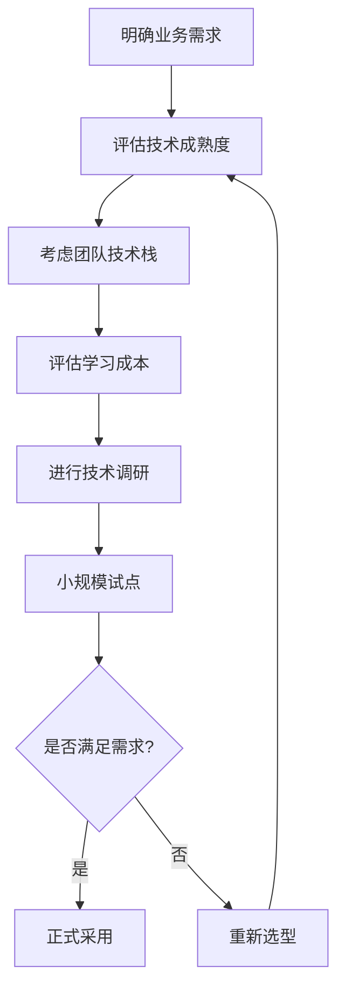

# Java后端技术选型指南

> @author erik.zhou

## 📋 目录
- [技术选型原则](#技术选型原则)
- [框架选型对比](#框架选型对比)
- [数据库选型对比](#数据库选型对比)
- [消息队列选型对比](#消息队列选型对比)
- [微服务组件选型](#微服务组件选型)
- [场景化选型建议](#场景化选型建议)

## 🎯 技术选型原则

### 1. 业务优先原则
- 技术服务于业务，不为技术而技术
- 根据业务规模和复杂度选择合适的技术
- 考虑团队技术栈和学习成本

### 2. 成熟度原则
- 优先选择成熟稳定的技术
- 关注社区活跃度和文档完善度
- 考虑技术的长期维护和支持

### 3. 性能原则
- 根据性能要求选择合适的技术
- 考虑并发量、响应时间、吞吐量
- 平衡性能和开发效率

### 4. 成本原则
- 考虑开发成本、运维成本、学习成本
- 评估技术的投入产出比
- 关注开源vs商业的选择

### 5. 可扩展性原则
- 考虑系统的未来扩展需求
- 选择支持水平扩展的技术
- 避免技术锁定

---

## 🔧 框架选型对比

### Spring Boot vs Spring Cloud

| 对比维度 | Spring Boot | Spring Cloud |
|---------|-------------|--------------|
| **定位** | 单体应用快速开发 | 微服务架构解决方案 |
| **适用场景** | 中小型项目、快速原型 | 大型分布式系统 |
| **学习曲线** | ⭐⭐⭐ | ⭐⭐⭐⭐ |
| **开发效率** | 高 | 中 |
| **运维复杂度** | 低 | 高 |
| **推荐指数** | ⭐⭐⭐⭐⭐ | ⭐⭐⭐⭐ |

**选型建议**：
- **小型项目**（<10人团队）：Spring Boot单体应用
- **中型项目**（10-50人团队）：Spring Boot + 简单微服务
- **大型项目**（>50人团队）：Spring Cloud完整微服务架构

---

### MyBatis vs Hibernate/JPA

| 对比维度 | MyBatis | Hibernate/JPA |
|---------|---------|---------------|
| **SQL控制** | 完全控制 | 自动生成 |
| **学习曲线** | ⭐⭐⭐ | ⭐⭐⭐⭐ |
| **灵活性** | 高 | 中 |
| **开发效率** | 中 | 高 |
| **性能优化** | 容易 | 较难 |
| **适用场景** | 复杂SQL、性能要求高 | 简单CRUD、快速开发 |
| **推荐指数** | ⭐⭐⭐⭐⭐ | ⭐⭐⭐ |

**选型建议**：
- **复杂业务逻辑**：MyBatis（更好的SQL控制）
- **简单CRUD**：MyBatis-Plus（提高开发效率）
- **跨数据库**：Hibernate/JPA（更好的数据库兼容性）
- **国内项目**：MyBatis（生态更成熟，文档更丰富）

---

## 💾 数据库选型对比

### 关系型数据库

| 数据库 | 优势 | 劣势 | 适用场景 | 推荐指数 |
|-------|------|------|---------|---------|
| **MySQL** | 开源免费、生态成熟、性能优秀 | 复杂查询性能一般 | 互联网应用、中小型系统 | ⭐⭐⭐⭐⭐ |
| **PostgreSQL** | 功能强大、支持JSON、全文搜索 | 学习曲线陡峭 | 复杂查询、地理信息系统 | ⭐⭐⭐⭐ |
| **Oracle** | 功能最强大、性能最好 | 商业收费、成本高 | 大型企业、金融系统 | ⭐⭐⭐ |
| **SQL Server** | 与.NET集成好 | 商业收费、跨平台支持弱 | Windows环境、企业应用 | ⭐⭐ |

**选型建议**：
- **互联网项目**：MySQL（首选）
- **复杂查询**：PostgreSQL
- **大型企业**：Oracle（预算充足）
- **初创公司**：MySQL（成本低、生态好）

---

### NoSQL数据库

| 数据库 | 类型 | 优势 | 适用场景 | 推荐指数 |
|-------|------|------|---------|---------|
| **Redis** | KV存储 | 性能极高、数据结构丰富 | 缓存、会话、排行榜 | ⭐⭐⭐⭐⭐ |
| **MongoDB** | 文档数据库 | 灵活的Schema、易扩展 | 内容管理、日志存储 | ⭐⭐⭐⭐ |
| **Elasticsearch** | 搜索引擎 | 全文搜索、实时分析 | 日志分析、站内搜索 | ⭐⭐⭐⭐ |
| **HBase** | 列式存储 | 海量数据、高并发写入 | 大数据场景、时序数据 | ⭐⭐⭐ |

**选型建议**：
- **缓存场景**：Redis（必选）
- **搜索场景**：Elasticsearch
- **灵活Schema**：MongoDB
- **海量数据**：HBase + Hadoop

---

## 📨 消息队列选型对比

| 消息队列 | 优势 | 劣势 | 适用场景 | 推荐指数 |
|---------|------|------|---------|---------|
| **RabbitMQ** | 功能丰富、易用性好 | 性能一般、吞吐量低 | 中小型系统、复杂路由 | ⭐⭐⭐⭐ |
| **Kafka** | 高吞吐、高性能、持久化 | 功能相对简单 | 大数据、日志收集、流处理 | ⭐⭐⭐⭐⭐ |
| **RocketMQ** | 功能丰富、性能好、国产 | 社区相对小 | 电商、金融、互联网 | ⭐⭐⭐⭐ |
| **ActiveMQ** | 老牌MQ、功能完善 | 性能一般、社区不活跃 | 传统企业、遗留系统 | ⭐⭐ |

**性能对比**：

| 指标 | RabbitMQ | Kafka | RocketMQ |
|------|----------|-------|----------|
| **吞吐量** | 万级/秒 | 百万级/秒 | 十万级/秒 |
| **延迟** | 微秒级 | 毫秒级 | 毫秒级 |
| **可用性** | 高 | 非常高 | 高 |
| **消息顺序** | 支持 | 支持 | 支持 |
| **消息重试** | 支持 | 不支持 | 支持 |

**选型建议**：
- **日志收集、大数据**：Kafka（高吞吐量）
- **业务解耦、异步处理**：RocketMQ（功能丰富）
- **复杂路由、小规模**：RabbitMQ（易用性好）
- **金融、电商**：RocketMQ（事务消息）

---

## 🌐 微服务组件选型

### 服务注册与发现

| 组件 | 优势 | 劣势 | 推荐指数 |
|------|------|------|---------|
| **Nacos** | 功能全面、国产、文档丰富 | 相对年轻 | ⭐⭐⭐⭐⭐ |
| **Eureka** | Spring Cloud原生 | 已停止更新 | ⭐⭐⭐ |
| **Consul** | 功能强大、跨语言 | 学习曲线陡峭 | ⭐⭐⭐⭐ |
| **ZooKeeper** | 成熟稳定 | 非专业注册中心 | ⭐⭐⭐ |

**选型建议**：
- **新项目**：Nacos（首选）
- **Spring Cloud生态**：Nacos或Consul
- **跨语言**：Consul

---

### 配置中心

| 组件 | 优势 | 劣势 | 推荐指数 |
|------|------|------|---------|
| **Nacos** | 注册+配置一体、易用 | 功能相对简单 | ⭐⭐⭐⭐⭐ |
| **Apollo** | 功能强大、权限管理完善 | 部署复杂 | ⭐⭐⭐⭐ |
| **Spring Cloud Config** | Spring原生 | 功能简单 | ⭐⭐⭐ |

**选型建议**：
- **中小型项目**：Nacos（简单易用）
- **大型项目**：Apollo（权限管理、灰度发布）
- **Spring Cloud项目**：Nacos（一体化方案）

---

### 服务网关

| 组件 | 优势 | 劣势 | 推荐指数 |
|------|------|------|---------|
| **Spring Cloud Gateway** | 响应式、性能好、Spring生态 | 相对年轻 | ⭐⭐⭐⭐⭐ |
| **Zuul** | 成熟稳定 | 性能一般、已停止更新 | ⭐⭐ |
| **Kong** | 功能强大、跨语言 | 学习成本高 | ⭐⭐⭐⭐ |

**选型建议**：
- **Spring Cloud项目**：Spring Cloud Gateway（首选）
- **跨语言**：Kong
- **遗留系统**：Zuul（不推荐新项目使用）

---

### 限流降级

| 组件 | 优势 | 劣势 | 推荐指数 |
|------|------|------|---------|
| **Sentinel** | 功能丰富、国产、文档好 | 相对年轻 | ⭐⭐⭐⭐⭐ |
| **Hystrix** | 成熟稳定 | 已停止更新 | ⭐⭐ |
| **Resilience4j** | 轻量级、函数式 | 功能相对简单 | ⭐⭐⭐⭐ |

**选型建议**：
- **新项目**：Sentinel（首选）
- **轻量级需求**：Resilience4j
- **遗留系统**：Hystrix（不推荐新项目使用）

---

## 🎬 场景化选型建议

### 场景1：电商系统

**技术栈推荐**：
- **框架**：Spring Boot + Spring Cloud Alibaba
- **数据库**：MySQL（主库）+ Redis（缓存）+ Elasticsearch（搜索）
- **消息队列**：RocketMQ（订单、库存）
- **注册中心**：Nacos
- **配置中心**：Nacos
- **限流降级**：Sentinel
- **分布式事务**：Seata
- **网关**：Spring Cloud Gateway

**理由**：
- 高并发、高可用要求
- 需要分布式事务支持
- 需要实时搜索功能

---

### 场景2：内容管理系统

**技术栈推荐**：
- **框架**：Spring Boot
- **数据库**：MySQL + MongoDB（内容存储）
- **缓存**：Redis
- **搜索**：Elasticsearch
- **文件存储**：MinIO

**理由**：
- 灵活的内容结构（MongoDB）
- 全文搜索需求（Elasticsearch）
- 大量文件存储（MinIO）

---

### 场景3：数据分析平台

**技术栈推荐**：
- **框架**：Spring Boot
- **数据库**：MySQL + ClickHouse（分析）
- **消息队列**：Kafka（数据采集）
- **大数据**：Flink（实时计算）
- **可视化**：Grafana

**理由**：
- 海量数据处理（Kafka + Flink）
- 实时分析需求（ClickHouse）
- 数据可视化（Grafana）

---

### 场景4：社交平台

**技术栈推荐**：
- **框架**：Spring Boot + Spring Cloud
- **数据库**：MySQL + Redis + MongoDB
- **消息队列**：Kafka（消息推送）
- **实时通信**：Netty + WebSocket
- **推荐系统**：Spark MLlib

**理由**：
- 实时通信需求（Netty）
- 海量消息存储（MongoDB）
- 推荐算法（Spark）

---

### 场景5：金融系统

**技术栈推荐**：
- **框架**：Spring Boot + Spring Cloud
- **数据库**：Oracle（核心）+ MySQL（非核心）
- **消息队列**：RocketMQ（事务消息）
- **分布式事务**：Seata
- **监控**：SkyWalking + Prometheus

**理由**：
- 数据一致性要求高（Oracle + Seata）
- 事务消息支持（RocketMQ）
- 完善的监控（SkyWalking）

---

## 📊 技术成熟度评估

### 成熟度等级

| 等级 | 说明 | 推荐使用 |
|------|------|---------|
| **生产就绪** | 大规模生产环境验证 | ✅ 推荐 |
| **稳定版本** | 功能完善、bug较少 | ✅ 推荐 |
| **测试版本** | 功能基本完善、可能有bug | ⚠️ 谨慎 |
| **开发版本** | 功能不完善、不稳定 | ❌ 不推荐 |

### 主流技术成熟度

| 技术 | 成熟度 | 推荐使用 |
|------|--------|---------|
| Spring Boot | 生产就绪 | ✅ |
| Spring Cloud | 生产就绪 | ✅ |
| MyBatis | 生产就绪 | ✅ |
| MySQL | 生产就绪 | ✅ |
| Redis | 生产就绪 | ✅ |
| Kafka | 生产就绪 | ✅ |
| Nacos | 稳定版本 | ✅ |
| Sentinel | 稳定版本 | ✅ |
| Spring AI | 测试版本 | ⚠️ |

---

## 💡 选型决策流程

---

## 🎯 选型建议总结

### 通用建议
1. **优先选择成熟稳定的技术**
2. **考虑团队技术栈和学习成本**
3. **关注社区活跃度和文档质量**
4. **进行小规模试点验证**
5. **避免过度设计和技术堆砌**

### 避免的误区
- ❌ 盲目追求新技术
- ❌ 忽视团队技术能力
- ❌ 不考虑运维成本
- ❌ 过度设计
- ❌ 技术选型不统一

### 持续优化
- 定期评估技术栈
- 关注技术发展趋势
- 及时升级和优化
- 积累技术选型经验

---

**记住：没有最好的技术，只有最合适的技术！** 🎯
