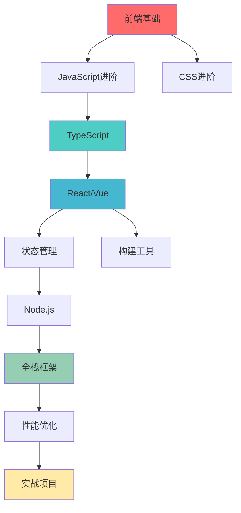

# 前端技术栈学习路线图

> @author erik.zhou

## 📋 目录
- [学习路径总览](#学习路径总览)
- [各阶段详细规划](#各阶段详细规划)
- [学习时间估算](#学习时间估算)
- [学习方法建议](#学习方法建议)

## 🗺️ 学习路径总览

## 📚 各阶段详细规划

### 阶段一：前端基础 (2-3个月)

**学习目标**：掌握前端三剑客的核心知识

#### 必学内容
1. **HTML5** (15-20小时)
   - 语义化标签
   - 表单和验证
   - Canvas和SVG
   - 多媒体元素
   - 本地存储

2. **CSS3** (25-35小时)
   - 选择器和优先级
   - 盒模型和布局
   - Flexbox和Grid
   - 动画和过渡
   - 响应式设计

3. **JavaScript基础** (40-50小时)
   - 基础语法和数据类型
   - 函数和作用域
   - 对象和原型
   - DOM操作
   - 事件处理

4. **ES6+新特性** (20-30小时)
   - let/const、解构赋值
   - 箭头函数、模板字符串
   - Promise、async/await
   - 模块化
   - Class语法

**学习检查清单**
- [ ] 能够独立编写语义化的HTML页面
- [ ] 掌握Flexbox和Grid布局
- [ ] 理解JavaScript闭包和原型链
- [ ] 能够处理异步操作

---

### 阶段二：前端框架 (3-4个月)

**学习目标**：掌握主流前端框架

#### 必学内容
1. **TypeScript** (30-40小时) 🔥
   - 基础类型和接口
   - 泛型和高级类型
   - 装饰器
   - 类型体操

2. **React** (50-60小时) 🔥
   - 组件和Props
   - State和生命周期
   - Hooks（useState、useEffect等）
   - Context API
   - 性能优化

3. **Vue 3** (40-50小时)
   - 模板语法
   - 响应式原理
   - Composition API
   - 组件通信
   - 生命周期

4. **状态管理** (25-35小时)
   - Redux Toolkit
   - Zustand
   - Pinia
   - 状态管理最佳实践

**学习检查清单**
- [ ] 能够使用TypeScript开发项目
- [ ] 掌握React Hooks的使用
- [ ] 理解Vue 3的响应式原理
- [ ] 能够选择合适的状态管理方案

---

### 阶段三：工程化 (2-3个月)

**学习目标**：掌握现代前端工程化工具

#### 必学内容
1. **构建工具** (30-40小时)
   - Webpack配置和优化
   - Vite快速开发
   - Rollup库打包
   - 构建性能优化

2. **包管理器** (15-25小时)
   - npm/yarn/pnpm
   - package.json配置
   - Monorepo管理
   - 依赖管理

3. **代码质量** (20-30小时)
   - ESLint配置
   - Prettier格式化
   - Husky Git钩子
   - 代码规范

4. **测试** (25-35小时)
   - Jest单元测试
   - React Testing Library
   - Cypress E2E测试
   - 测试覆盖率

**学习检查清单**
- [ ] 能够配置Webpack和Vite
- [ ] 掌握pnpm和Monorepo
- [ ] 能够编写单元测试和E2E测试
- [ ] 理解代码质量工具链

---

### 阶段四：Node.js全栈 (2-3个月)

**学习目标**：掌握Node.js后端开发

#### 必学内容
1. **Node.js基础** (25-35小时)
   - 模块系统
   - 文件系统
   - 流和Buffer
   - 事件循环

2. **Web框架** (30-40小时)
   - Express基础
   - Koa中间件
   - NestJS企业级框架
   - RESTful API设计

3. **数据库** (25-35小时)
   - MySQL/PostgreSQL
   - MongoDB
   - Prisma ORM
   - 数据库设计

4. **认证授权** (15-25小时)
   - JWT
   - OAuth 2.0
   - Session管理
   - 权限控制

**学习检查清单**
- [ ] 能够使用Node.js开发后端API
- [ ] 掌握NestJS框架
- [ ] 理解数据库设计和ORM
- [ ] 能够实现认证授权

---

### 阶段五：现代化开发 (2-3个月)

**学习目标**：掌握现代化全栈开发

#### 必学内容
1. **Next.js** (35-45小时) 🔥
   - App Router
   - Server Components
   - 数据获取
   - 部署优化

2. **Nuxt 3** (30-40小时)
   - 自动导入
   - 服务端渲染
   - Nitro引擎
   - 部署

3. **GraphQL** (25-35小时)
   - Schema设计
   - Apollo Client
   - 查询优化
   - 实时订阅

4. **tRPC** (20-30小时)
   - 类型安全API
   - 客户端集成
   - 中间件
   - 最佳实践

**学习检查清单**
- [ ] 能够使用Next.js开发全栈应用
- [ ] 理解SSR和SSG
- [ ] 掌握GraphQL的使用
- [ ] 了解tRPC的优势

---

### 阶段六：移动端开发 (2-3个月)

**学习目标**：掌握移动端开发技术

#### 必学内容
1. **React Native** (40-50小时)
   - 组件和样式
   - 导航
   - 原生模块
   - 性能优化

2. **小程序** (30-40小时)
   - 微信小程序
   - 生命周期
   - 组件化
   - 云开发

3. **跨平台方案** (25-35小时)
   - uni-app
   - Taro
   - 技术选型
   - 最佳实践

**学习检查清单**
- [ ] 能够开发React Native应用
- [ ] 掌握小程序开发
- [ ] 了解跨平台方案的优劣
- [ ] 能够进行移动端性能优化

---

### 阶段七：性能优化 (1-2个月)

**学习目标**：掌握前端性能优化技巧

#### 必学内容
1. **性能监控** (15-25小时)
   - Performance API
   - Lighthouse
   - Web Vitals
   - 性能指标

2. **加载优化** (20-30小时)
   - 代码分割
   - 懒加载
   - 预加载
   - CDN优化

3. **渲染优化** (20-30小时)
   - 虚拟列表
   - 防抖节流
   - React优化
   - 重排重绘

4. **打包优化** (15-25小时)
   - Tree Shaking
   - 压缩混淆
   - 分析工具
   - 缓存策略

**学习检查清单**
- [ ] 能够使用性能监控工具
- [ ] 掌握各种优化技巧
- [ ] 理解性能指标
- [ ] 能够分析和解决性能问题

---

## ⏱️ 学习时间估算

| 阶段 | 预计时长 | 累计时长 |
|------|---------|---------|
| 阶段一：前端基础 | 2-3个月 | 2-3个月 |
| 阶段二：前端框架 | 3-4个月 | 5-7个月 |
| 阶段三：工程化 | 2-3个月 | 7-10个月 |
| 阶段四：Node.js全栈 | 2-3个月 | 9-13个月 |
| 阶段五：现代化开发 | 2-3个月 | 11-16个月 |
| 阶段六：移动端开发 | 2-3个月 | 13-19个月 |
| 阶段七：性能优化 | 1-2个月 | 14-21个月 |

**说明**：
- 以上时间基于每天学习2-3小时估算
- 实际时间因个人基础和学习效率而异
- 建议边学边做项目，加深理解

---

## 💡 学习方法建议

### 1. 理论+实践结合
- 每学完一个知识点，立即动手实践
- 通过编写Demo加深理解
- 参与开源项目或实战项目

### 2. 构建知识体系
- 使用思维导图整理知识点
- 建立技术之间的关联
- 定期回顾和总结

### 3. 阅读优秀源码
- 阅读React、Vue等框架源码
- 理解设计思想和实现原理
- 学习优秀的代码风格

### 4. 关注技术动态
- 关注官方文档更新
- 阅读技术博客和文章
- 参加技术社区和会议

### 5. 刻意练习
- 针对薄弱环节重点突破
- 多做项目和练习
- 准备技术面试

---

## 🎯 学习里程碑

### 初级阶段（0-3个月）
- ✅ 掌握HTML/CSS/JavaScript基础
- ✅ 能够开发简单的静态页面
- ✅ 理解基本的DOM操作

### 中级阶段（3-8个月）
- ✅ 掌握React或Vue框架
- ✅ 能够使用TypeScript开发
- ✅ 理解前端工程化

### 高级阶段（8-15个月）
- ✅ 掌握全栈开发能力
- ✅ 能够进行性能优化
- ✅ 具备架构设计能力

### 专家阶段（15个月+）
- ✅ 深入理解底层原理
- ✅ 能够解决复杂的技术问题
- ✅ 具备技术领导力

---

## 📖 推荐学习资源

### 书籍
- 《JavaScript高级程序设计》
- 《你不知道的JavaScript》
- 《深入浅出React和Redux》
- 《Vue.js设计与实现》
- 《Node.js设计模式》

### 在线资源
- MDN Web Docs（优先）
- React官方文档
- Vue官方文档
- GitHub开源项目
- 技术博客和公众号

### 实战项目
- TodoMVC
- 个人博客
- 后台管理系统
- 电商平台
- 社交应用

---

**记住：前端技术日新月异，保持学习和探索的热情！** 🚀

@author erik.zhou
